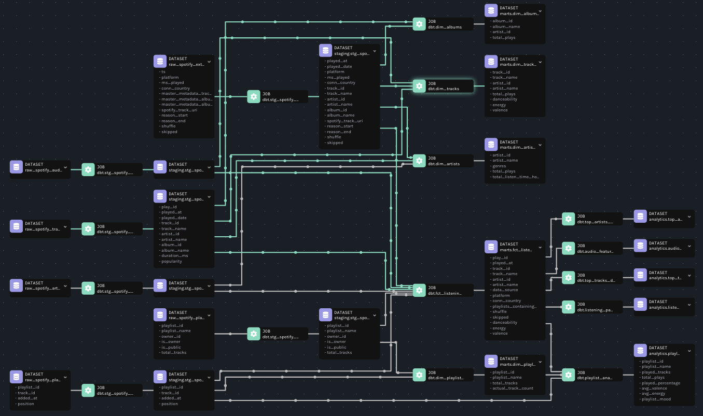

# All-Time Spotify Wrapped

## Update Notes
See the [Update Notes](Update%20Note.md) for recent changes and updates to the project.

## Overview
A comprehensive data pipeline that extracts, transforms, and visualizes a user's complete Spotify listening history using modern data engineering tools and practices.

## Reference

This project is built upon concepts from [spotify-api](https://github.com/calbergs/spotify-api.git) by calbergs and is developed further into incorporating DuckDB for OLAP database as well as OpenLineage and Marquez for complete column level data lineage. 

## Objective

Deep dive into a my complete song listening history to analyze top artists, tracks, genres, and extensive listening patterns. This project recreates "Spotify Wrapped" that can be viewed at any time of year with richer insights.

**Key Features:**
- **Real-time Tracking**: Hourly API calls during active hours (0-6, 14-23 UTC)
- **Historical Analysis**: Integrates 2+ years of extended streaming history (89K+ plays)
- **Playlist Trend Discovery**: Tracks which playlists contain my favorite songs
- **Data Lineage**: Complete column-level lineage tracking with OpenLineage + Marquez
- **Cost Efficient**: 100% open-source tools, hosted locally

## Tools & Technologies

| Category | Technology |
|----------|-----------|
| **Containerization** | [Docker](https://www.docker.com), [Docker Compose](https://docs.docker.com/compose/) |
| **Orchestration** | [Apache Airflow](https://airflow.apache.org) |
| **Storage** | [DuckDB](https://duckdb.org) (analytical) |
| **Transformation** | [dbt Core](https://www.getdbt.com) |
| **Visualization** | [Metabase](https://www.metabase.com) with [DuckDB Driver](https://github.com/motherduckdb/metabase_duckdb_driver) |
| **Lineage** | [OpenLineage](https://openlineage.io), [Marquez](https://marquezproject.ai) |
| **Language** | [Python 3.10](https://www.python.org) |
| **API** | [Spotify Web API](https://developer.spotify.com/documentation/web-api) |

## Architecture

### Data Flow

#### 1. **Extraction**
- **API Extraction** (`extract_spotify_data`):
  - Calls Spotify API for recently played tracks (50 most recent)
  - Fetches artist details and playlist information
  - Saves responses as CSV files with timestamp
  - Runs hourly during active hours (9AM - 3PM CST) and once on 9PM CST

- **Extended History** (`load_extended_history`):
  - Requested Extended Streaming History data from [Spotify](https://www.spotify.com/us/account/privacy/)
  - One-time load of historical streaming data (2022-2025)
  - Contains 230,000+ plays with rich context (platform, country, shuffle, skip reasons)
  - **Smart Skip**: Checks if data exists and skips reload to save full load time (~40s)

#### 2. **Loading** 
- **DuckDB Loader** (`load_to_duckdb`):
  - Creates/updates raw tables in DuckDB
  - Uses upsert logic to handle duplicates
  - Parallel execution with extended history load

#### 3. **Transformation (dbt)**
- Divided into 3 layers
  1. `staging`: Silver data tables
  2. `marts`: Gold data models (Dimensional Modeling)
  3. `analytics`: analytical models from marts layer
- `raw` tables are stored in raw/{category}/{year}/{month}/{date} structure

#### 4. **Lineage Tracking**

- **OpenLineage Integration** (`dbt-ol`):
  - Automatically emits column-level lineage during dbt execution
  - Tracks transformations from raw sources through staging to analytics
  - Shows exactly which raw columns feed into each analytical metric

#### 5. **Visualization**
- **Metabase with DuckDB Driver**:
  - Metabase connects directly to DuckDB (no PostgreSQL needed due to DuckDB driver)
  - Uses custom Dockerfile with [DuckDB driver](https://github.com/motherduckdb/metabase_duckdb_driver)
  - Queries analytical tables directly from DuckDB for real-time insights

#### 6. **Quality & Documentation**
- **dbt Tests**: Validates data quality (uniqueness, not null, relationships)
- **dbt Docs**: Auto-generated documentation with data lineage graph
- **Slack Alerts**: Automatic notifications on pipeline failures/retries

## Dashboard & Insights

### Metabase Dashboard

## Slack Notifications

The pipeline automatically sends Slack alerts for:
- Task failures (after all retries exhausted)
- Task retries (immediate notification)
- Success after retry

## License

This is a personal project for educational and analytical purposes. Spotify API usage complies with [Spotify's Developer Terms](https://developer.spotify.com/terms).

## Acknowledgments

- calbergs for the basic idea of the project
- Spotify for providing comprehensive Web API
- Open-source communities behind Airflow, dbt, DuckDB, OpenLineage, and Marquez
- Inspired by Spotify Wrapped