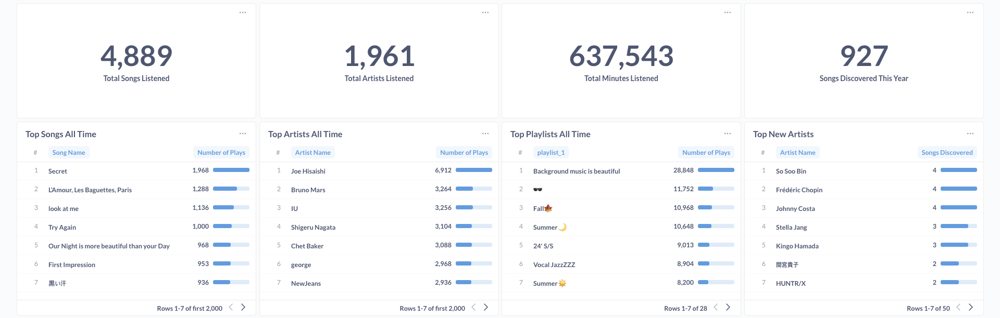
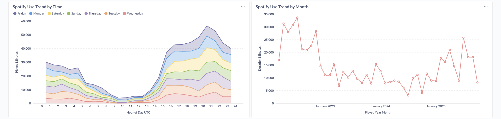
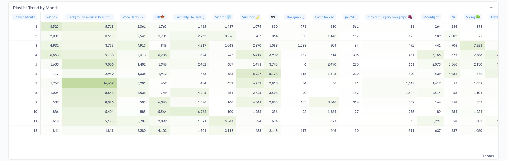

# All-Time Spotify Wrapped

A comprehensive data pipeline that extracts, transforms, and visualizes a user's complete Spotify listening history using modern data engineering tools and practices.

## Reference

This project is built upon concepts from [spotify-api](https://github.com/calbergs/spotify-api.git) by calbergs and is developed further into incorporating DuckDB for OLAP database as well as OpenLineage and Marquez for complete column level data lineage. 

## 🎯 Objective

Deep dive into a my complete song listening history to analyze top artists, tracks, genres, listening patterns, and audio feature preferences. This project recreates "Spotify Wrapped" that can be viewed at any time of year with richer insights.

**Key Features:**
- ✅ **Real-time Tracking**: Hourly API calls during active hours (0-6, 14-23 UTC)
- ✅ **Historical Analysis**: Integrates 2+ years of extended streaming history (89K+ plays)
- ✅ **Playlist Trend Discovery**: Tracks which playlists contain my favorite songs
- ✅ **Data Lineage**: Complete column-level lineage tracking with OpenLineage + Marquez
- ✅ **Cost Efficient**: 100% open-source tools, hosted locally

## 🛠 Tools & Technologies

| Category | Technology |
|----------|-----------|
| **Containerization** | [Docker](https://www.docker.com), [Docker Compose](https://docs.docker.com/compose/) |
| **Orchestration** | [Apache Airflow](https://airflow.apache.org) |
| **Storage** | [DuckDB](https://duckdb.org) (analytical), [PostgreSQL](https://www.postgresql.org) (Metabase) |
| **Transformation** | [dbt Core](https://www.getdbt.com) |
| **Visualization** | [Metabase](https://www.metabase.com) |
| **Lineage** | [OpenLineage](https://openlineage.io), [Marquez](https://marquezproject.ai) |
| **Language** | [Python 3.10](https://www.python.org) |
| **API** | [Spotify Web API](https://developer.spotify.com/documentation/web-api) |

## 📊 Architecture

```
Architecture drawings coming soon.
```

### Data Flow

#### 1️⃣ **Extraction**
- **API Extraction** (`extract_spotify_data`):
  - Calls Spotify API for recently played tracks (50 most recent)
  - Fetches audio features, artist details, and playlist information
  - Saves responses as CSV files with timestamp
  - Runs hourly during active hours (0-6, 14-23 UTC)

- **Extended History** (`load_extended_history`):
  - Requested Extended Streaming History data from [Spotify](https://www.spotify.com/us/account/privacy/)
  - One-time load of historical streaming data (2022-2025)
  - Contains 230,000+ plays with rich context (platform, country, shuffle, skip reasons)
  - **Smart Skip**: Checks if data exists and skips reload to save full load time (~40s)

#### 2️⃣ **Loading** 
- **DuckDB Loader** (`load_to_duckdb`):
  - Creates/updates raw tables in DuckDB
  - Tables: `raw_spotify_tracks`, `raw_spotify_audio_features`, `raw_spotify_artists`, `raw_spotify_playlists`, `raw_spotify_playlist_tracks`, `raw_spotify_extended_history`
  - Uses upsert logic to handle duplicates
  - Parallel execution with extended history load

#### 3️⃣ **Transformation (dbt)**
- **Staging Layer**:
  - `stg_spotify_tracks` - Cleans and deduplicates API track data
  - `stg_spotify_extended_history` - Parses extended history with track ID extraction
  - `stg_spotify_audio_features` - Normalizes audio characteristics
  - `stg_spotify_artists` - Artist metadata with SCD Type 1
  - `stg_spotify_playlists` - Playlist information
  - `stg_spotify_playlist_tracks` - Track-playlist relationships

- **Marts Layer**:
  - `dim_tracks` - Track dimension (combines API + extended history)
  - `dim_artists` - Artist dimension with play counts and listening time
  - `dim_albums` - Album dimension with aggregated stats
  - `dim_playlists` - Playlist dimension with track counts
  - `fct_listening_history` - **Core fact table** with:
    - Extended history context (platform, shuffle, skip, country)
    - Audio features joined in
    - Data source tracking (API vs extended history)

- **Analytics Layer**:
  - `top_tracks_daily` - Daily top track rankings
  - `top_artists_daily` - Daily artist popularity
  - `listening_patterns_hourly` - Time-based listening behavior (CST)
  - `audio_features_analysis` - Mood and audio preference trends
  - `playlist_analysis` - Playlist engagement and mood analysis

#### 4️⃣ **Lineage Tracking**

- **OpenLineage Integration** (`emit_lineage`):
  - Emits column-level lineage for all 16 dbt models
  - Tracks transformations from raw sources through staging to analytics
  - Shows exactly which raw columns feed into each analytical metric

#### 5️⃣ **Data Sync**
- **PostgreSQL Sync** (`sync_to_postgres`):
  - Copies analytical tables from DuckDB to PostgreSQL
  - Metabase connects to PostgreSQL for visualization
  - Automatically recreates tables to pick up schema changes

#### 6️⃣ **Quality & Documentation**
- **dbt Tests**: Validates data quality (uniqueness, not null, relationships)
- **dbt Docs**: Auto-generated documentation with data lineage graph
- **Slack Alerts**: Automatic notifications on pipeline failures/retries


## 📈 Data Schema

### Key Metrics Available

**Listening History Facts:**
- Play timestamps (UTC & CST)
- Track, artist, album details
- Audio features (danceability: 0-1, energy: 0-1, valence: 0-1, tempo: BPM)
    - Not available due to it only being available for Spotify Premium users
- Playlist associations (up to 5 playlists per track)
- Extended context (platform, country, shuffle, skip reasons)
- Data source provenance (API, historical)

**Dimensions:**
- 4,000+ unique tracks
- Hundreds of artists with genre classifications
- User playlists with track counts

**Time Intelligence:**
- Hourly patterns
- Daily, weekly, monthly aggregations
- First/last play timestamps
- Days active metrics

## 📊 Dashboard & Insights

### Metabase Dashboard




### dbt Documentation
- **Features**:
  - Interactive data lineage graph
  - Column-level documentation
  - Model dependencies
  - Test results
  - Source freshness

### Marquez Lineage
- **Features**:
  - Complete data lineage from raw to analytics
  - Column-level transformations
  - Job run history
  - Dataset metadata

### Airflow UI
- **Features**:
  - DAG monitoring and triggering
  - Task logs and status
  - Execution history
  - Manual task reruns


## 🔧 Key Files

### `dags/spotify_dag.py`
- Defines the complete pipeline workflow
- Parallel task execution where possible
- Slack alert callbacks on failures/retries
- Scheduled to run hourly during active hours

### `scripts/spotify_extractor.py`
- OAuth token management with auto-refresh
- Fetches recently played tracks, audio features, artists, playlists
- Saves timestamped CSV files as replayable source
- Handles API rate limits and errors

### `scripts/load_extended_history.py`
- One-time loader for historical streaming data
- Filters music tracks from podcasts/audiobooks
- Smart skip logic (checks if data exists)
- Parses track URIs to extract IDs

### `dbt_project/models/marts/fct_listening_history.sql`
- Core fact table combining API + extended history
- Separate columns for up to 5 playlists per track
- CST timezone conversion for local time analysis
- Rich context: platform, country, shuffle, skip reasons

### `scripts/emit_lineage.py`
- Emits OpenLineage events for all 16 dbt models
- Column-level lineage from raw sources to analytics
- Tracks transformations and data flow
- Integrates with Marquez for visualization


## 🔔 Slack Notifications


The pipeline automatically sends Slack alerts for:
- ❌ Task failures (after all retries exhausted)
- 🔄 Task retries (immediate notification)
- ✅ Success after retry

**Setup:**
1. Create a Slack app and incoming webhook
2. Add webhook URL to `.env` as `SLACK_WEBHOOK_URL`


## 📝 License

This is a personal project for educational and analytical purposes. Spotify API usage complies with [Spotify's Developer Terms](https://developer.spotify.com/terms).

## 🙏 Acknowledgments

- calbergs for the basic guideline of the project
- Spotify for providing comprehensive Web API
- Open-source communities behind Airflow, dbt, DuckDB, OpenLineage, and Marquez
- Inspired by Spotify Wrapped